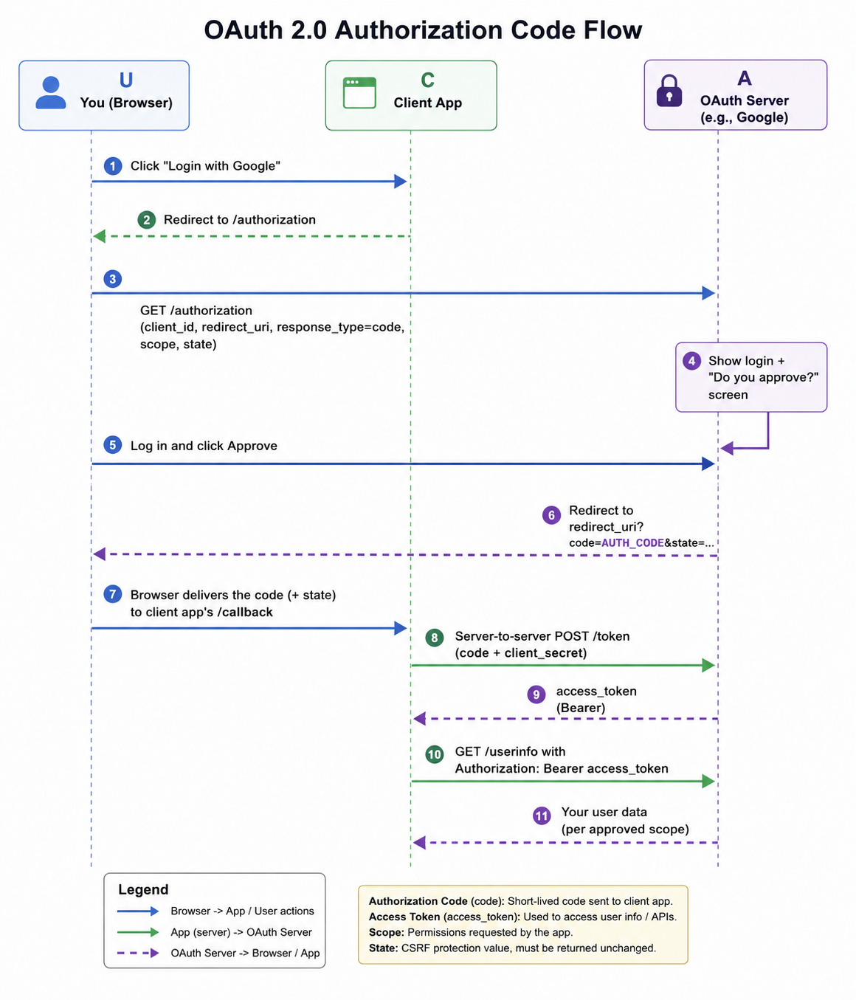
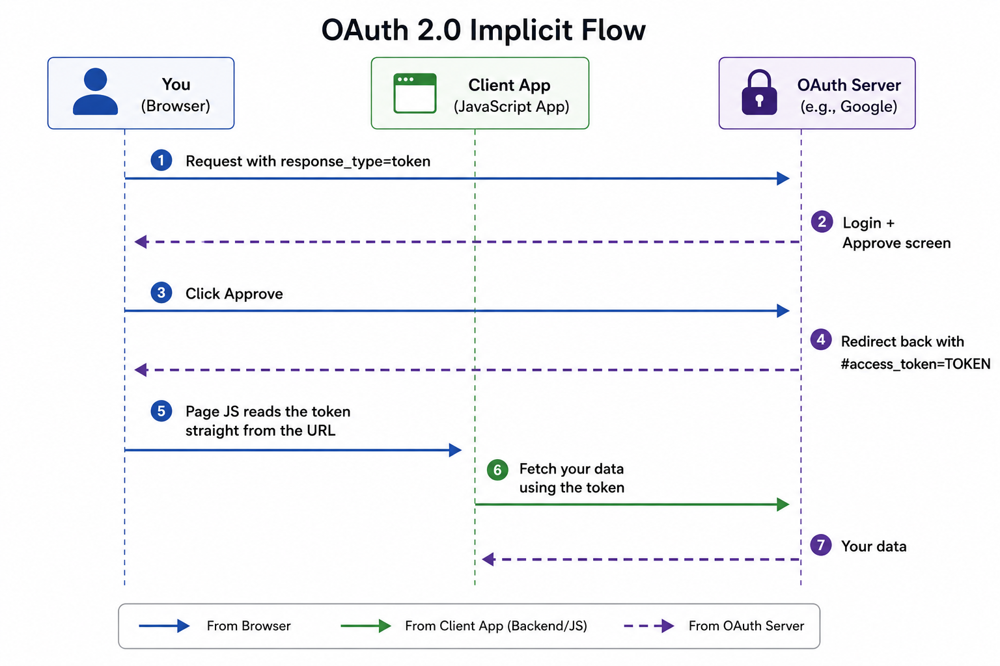

**OAuth 2.0** is an open-standard authorization framework. It lets a third-party app get limited access to your data on another site — without ever seeing your password.

It does this using **access tokens**. A token is just a piece of text that proves "this app is allowed to do X." It has an expiry time and limited permissions (called **scope**).

<aside>
💡

Real-world analogy: a hotel key card. You don't get the master key (your password). The front desk (OAuth provider) gives you a card (token) that only opens your room (limited scope) for a limited time.

</aside>

---

## **The three parties in OAuth**

Before the flow makes sense, know who's involved:

| **Role** | **In plain English** |
| --- | --- |
| Client Application | The app that wants your data (e.g. a shopping site with "Login with Google") |
| Resource Owner | You. The person whose data is being shared |
| OAuth Service Provider | Google/Facebook/etc. Runs two things: the **Authorization Server** (handles login + "do you approve?") and the **Resource Server** (holds your actual data, like your profile info) |

---

## **The basic flow, in 4 steps**

1. Client app says "I want access to X" and picks a **grant type** (explained below)
2. You log in to the provider and click **Approve**
3. Client app receives an **access token**
4. Client app uses that token to fetch your data from the provider's API

That's it. Everything below is just variations and attacks on this basic flow.

---

## **Grant types = different ways to run this flow**

A **grant type** is just *which method* is used to get the token. There are two main ones you'll see in the wild.

### **1. Authorization Code flow — the safe one**

This one's used whenever the client app has its own **backend server** — basically anywhere a secret can be kept away from the user's browser.

The trick that makes it safe: your browser only ever handles a short-lived, single-use **code**. That code gets swapped for the real **access token** later, but that swap happens **directly between two servers** — your browser isn't involved, and neither is anyone snooping on your browser traffic.



Walking through it step by step:

**1. The app starts the OAuth process.** The app redirects your browser to the provider’s login page with some information in the URL:

```
GET /authorization?client_id=12345&redirect_uri=https://client-app.com/callback&response_type=code&scope=openid%20profile&state=ae13d489bd00e3c24 HTTP/1.1
Host: oauth-authorization-server.com
```

Worth knowing what each bit does:

- `client_id` — a public ID for the app, handed out when it registered with the provider. Not secret.
- `redirect_uri` — where you should land afterward, code in hand. Also called the **callback URL**. This one parameter is behind a huge chunk of real-world OAuth bugs, because a lot of providers don't validate it as strictly as they should (more on that further down).
- `response_type=code` — says "I want the code flow specifically," as opposed to other grant types.
- `scope` — the specific slice of your data being requested.
- `state` — a random value the app makes up and expects unchanged in the response. Think of it as a receipt: when it comes back, the app checks the receipt matches, confirming the person finishing the flow is the same one who started it. Skip this and you open the door to CSRF attacks.

**2. You log in and give the thumbs up.** Standard login screen, then a consent screen listing exactly what's being requested, pulled straight from `scope`. Fun fact: once you've approved a given app, this becomes a one-click affair on future visits, as long as your session with the provider is still alive.

**3. Your browser gets handed a code.** Assuming you approved, the provider bounces you back to `redirect_uri` with a fresh code attached:

```
GET /callback?code=a1b2c3d4e5f6g7h8&state=ae13d489bd00e3c24 HTTP/1.1
Host: client-app.com
```

The app checks that `state` matches what it sent in step 1. If it doesn't, something's wrong — reject the request.

**4. Behind the scenes, the code gets cashed in.** This is where things move off the browser entirely. The client app's server talks directly to the provider's server:

```
POST /token HTTP/1.1
Host: oauth-authorization-server.com

client_id=12345&client_secret=SECRET&redirect_uri=https://client-app.com/callback&grant_type=authorization_code&code=a1b2c3d4e5f6g7h8
```

Two things you haven't seen yet:

- `client_secret` — basically a password for the app itself, given out at registration. It proves this request is really coming from the legit app and not some copycat. It lives only on the server — your browser never sees it, ever.
- `grant_type=authorization_code` — confirms to this endpoint which flow is in play.

<aside>
🔑

This is exactly why the flow is considered safe: the code from step 3 does nothing on its own. Cashing it in for a token also needs the `client_secret`, and that never leaves the app's server. So even if an attacker somehow grabs the code out of your URL bar, it's a dead end for them.

</aside>

**5. Provider hands back a token.** Code and secret both check out, here's your token:

```
{
    "access_token": "z0y9x8w7v6u5",
    "token_type": "Bearer",
    "expires_in": 3600,
    "scope": "openid profile"
}
```

`expires_in` is a countdown in seconds — 3600 means this token dies in an hour.

**6. Client app finally fetches your data.** It attaches the token as a `Bearer` credential:

```
GET /userinfo HTTP/1.1
Host: oauth-resource-server.com
Authorization: Bearer z0y9x8w7v6u5
```

**7. Data comes back.** The resource server double-checks the token is real and belongs to this app, then replies with whatever the scope allows:

```jsx
{
    "username": "alexj",
    "email": "alex.j@example.com"
}
```

From here, the app usually treats this as proof of who you are and logs you in.

### **2. Implicit flow — the risky one**

Used by apps that are **pure front-end** (just JavaScript, no backend server) — like old-school single-page apps. There's no secret to protect, so there's no code-swap step. The token comes straight back to the browser.



<aside>
⚠️

Notice the token shows up after a `#` symbol, not a `?`. That `#` part of a URL is called a **fragment**. Browsers never send fragments to a server — only JavaScript on the page can read it. This was meant to keep the token safe from network snooping, but it opens up a different set of tricks (see below).

</aside>

### **Quick comparison**

| **Question** | **Authorization Code** | **Implicit** |
| --- | --- | --- |
| Needs a backend server? | Yes | No |
| Does the token ever touch the browser? | No — only the code does | Yes, directly |
| Used by | Classic server-rendered apps | Old-school SPAs (modern SPAs now use code flow + PKCE instead) |
| Overall risk | Lower | Higher |

---

## **Spotting OAuth while testing a site**

- Look for any "Login with X" button
- Watch your Burp traffic — the very first request will hit something like `/authorize` or `/authorization`, with `client_id`, `redirect_uri`, and `response_type` in the URL
- Check these two URLs — they're standard, and often just... there:
    - `/.well-known/oauth-authorization-server`
    - `/.well-known/openid-configuration`

These two endpoints often dump the entire OAuth config: supported scopes, all valid endpoints, response modes. Free recon.

---

## **Why OAuth breaks so often**

Here's the root cause of nearly every bug on this page: **the OAuth spec doesn't force security.**

Things like strict `redirect_uri` checking, using `state` properly, and validating `scope` are all *optional* in the spec. Every company implements OAuth slightly differently, and a lot of them skip the optional-but-important parts. On top of that, sensitive values (codes, tokens) pass through the user's browser — a place attackers can often reach.

---

## **Attack techniques & bypasses**

### A. Bugs on the client app's side

-  **1. Client trusts the token without checking who it belongs to**
    
    Some apps using the implicit flow work like this: the browser gets a token + a user ID, then `POST`s both to the client app's own backend to log the user in.
    
    **The bug:** if the backend doesn't check that the token *actually belongs to* that user ID, an attacker can just send their own valid token alongside the victim's user ID.
    
    Result: instant account takeover — you're logged in as the victim, using your own token.
    
    **What should happen instead:** the server should look up who the token belongs to itself (by calling the OAuth provider), never trust an ID sent by the client.
    
- **2. Missing or weak `state` parameter → CSRF**
    
    `state` is a random, unguessable value the client app generates and sends at the start of the flow. Its whole job is to stop CSRF (Cross-Site Request Forgery — tricking a victim's browser into making a request they didn't intend to).
    
    **If `state` is missing or not checked:**
    
    1. Attacker starts their own OAuth login, gets a valid `code`/`token` — for their own account
    2. Attacker tricks the victim into visiting a page that finishes that flow using the attacker's code (auto-submitting form, hidden image, etc.)
    3. The victim's account on the client app now gets **linked to the attacker's social account**
    4. Attacker can now log in to the victim's account, just by logging in with their own Google/Facebook account
    
    Even on OAuth-only login (no separate password), a missing `state` still enables **login CSRF** — forcing the victim to unknowingly log in as the attacker, which can be used to capture data the victim types in (like saved card details).
    

### B. Bugs on the OAuth provider's side

- **3. Leaking the code/token by breaking redirect_uri validation**
    
    This is the most common and most dangerous OAuth bug class.
    
    `redirect_uri` tells the provider where to send the user back to, with the code/token attached. If the provider doesn't check this value strictly, an attacker can point it at their own server instead — and steal the code or token directly.
    
    **Things to try against `redirect_uri`:**
    
    - **Loose matching** — server only checks the URL *starts with* the right value:
    
    ```
    https://client-app.com.evil-user.net
    https://client-app.com@evil-user.net
    https://client-app.com/../evil
    ```
    
    - **URL parser confusion** (same tricks used in SSRF/CORS bypasses — different parts of the stack read the URL differently):
    
    ```
    https://default-host.com &@foo.evil-user.net#@bar.evil-user.net/
    ```
    
    - **Parameter pollution** — send `redirect_uri` twice. Sometimes the check happens on the first value, but the redirect actually uses the second:
    
    ```
    https://oauth-server.com/authorize?client_id=123&redirect_uri=client-app.com/callback&redirect_uri=evil-user.net
    ```
    
    - **Abusing trust in `localhost`** — some servers allow anything starting with `localhost` (for developers testing locally):
    
    ```
    https://localhost.evil-user.net
    ```
    
    - **Changing `response_mode`** (e.g. switching from `query` to `fragment`) can change how `redirect_uri` gets parsed downstream — sometimes unlocking a bypass that didn't work before. Also try `web_message` mode; it sometimes loosens which subdomains are allowed.

<br>
    <aside>
    🎯
    **Tip:** don't test only the `redirect_uri` alone. Try changing it *together with* other parameters (grant type, response_mode, scope). Changing one can quietly change how another gets validated.
    </aside>
    
- **4. Bouncing through a trusted page (when redirect_uri is locked down tight)**
    
    If you can't point `redirect_uri` outside the real domain, try pointing it at a *different page* on that same trusted domain:
    
    ```
    https://client-app.com/oauth/callback/../../example/path
    → browser resolves this to → https://client-app.com/example/path
    ```
    
    Then look at that page for any way to leak the code/token out to yourself:
    
    | **Technique** | **How it leaks the token** |
    | --- | --- |
    | Open redirect | Page auto-forwards the victim (code/token still in the URL) straight to your domain |
    | Unsafe JavaScript / bad `postMessage` handler | Page script reads the URL and echoes it somewhere you control |
    | XSS (Cross-Site Scripting) | Your injected script reads the token straight from the page — works even if session cookies are `HttpOnly`, since the token is a separate secret |
    | HTML injection | Inject ``. Some browsers (Firefox) send the *full URL, query string included*, in the `Referer` header when that image loads — leaking an authorization code |
    
    One catch: for the **authorization code** flow, you need the code from the query string. For the **implicit** flow, you need the fragment (`#...`) — and since fragments never get sent to a server, the Referer-leak trick above won't work there. You'd need one of the other techniques (XSS, bad JS) instead.
    
- **5. Scope upgrade — getting more access than you were granted**
    
    **Scope** is the list of permissions attached to a token (e.g. "read your email" vs "read your email + see your friends list").
    
    **On the authorization code flow:** register your own OAuth client app, but ask for a small scope (e.g. just `openid email`) when the victim approves it. Then, during the code-to-token swap — which you control — quietly add a bigger scope:
    
    ```
    POST /token
    ...&grant_type=authorization_code&code=a1b2c3d4e5f6g7h8&scope=openid%20email%20profile
    ```
    
    If the server doesn't double-check this against what the user actually approved, it hands you a token with extra access anyway.
    
    **On the implicit flow:** steal a token using any of the leak techniques above, then call `/userinfo` yourself and just add a bigger `scope` parameter to the request. Works if the check is missing — capped only by what your client app was ever allowed to request in the first place.
    
- **6. Provider allows unverified email → account takeover**
    
    If the OAuth provider lets people sign up without confirming they actually own the email address, an attacker can register a new account using the **victim's email**.
    
    Client apps that assume "email came from the OAuth provider, so it must be verified" will then treat that attacker account as if it belongs to the victim — letting the attacker log in as them.
    

---

## OpenID Connect (OIDC) — a quick add-on

**OIDC** is a small layer built on top of OAuth that adds real *authentication* (proving who you are), not just authorization (permission to access data). It adds:

- An `id_token` — a signed token that says "this is definitely user X"
- A standard `/userinfo` endpoint
- Standardized user info fields (claims)

A couple of extra bug classes come with it:

- **Open dynamic client registration** — if anyone can register as a new "client app" with the provider (sometimes even choosing their own redirect URI), that's a big red flag
- **`request_uri` injection** — some setups let the client point to a remote URL that contains the authorization request details. If an attacker controls that URL, they control the request

---

## Reference

- **1.[Oauth](https://www.oauth.com/)** 
- **2.[Portswigger](https://portswigger.net/web-security/oauth)**