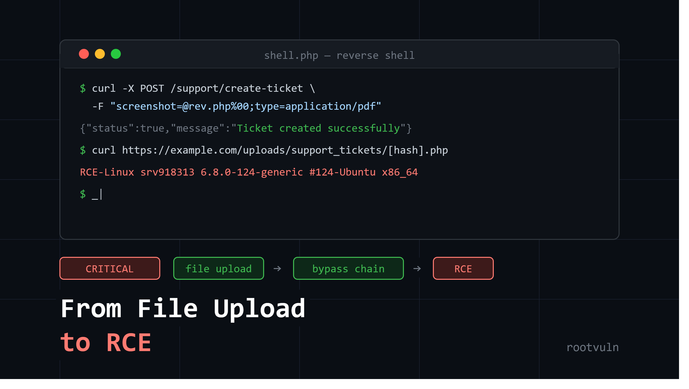

# File Upload → RCE: Bypassing MIME Type Validation (Core Idea)

## The Target
A support-ticket upload feature on a PHP backend. Standard file-type validation was in place, and it was actually pretty solid on its own.

## What Failed (each blocked individually)
- **Direct `.php` upload** → blocked, extension denylisted
- **Double extension** (`rev.php.jpg`) → blocked, server explicitly checks for double extensions
- **Null byte injection** (`rev.php%00.jpg`) → blocked, null bytes stripped and underlying `.php` still detected
- **Content-Type spoofing alone** (`image/jpeg` with PHP content) → blocked
- **Magic byte spoofing** (GIF header + PHP content) → blocked

Every technique, tried on its own, failed. The validation logic was well-built for single-vector attacks.

## The Winning Combo
The bypass wasn't one trick — it was **stacking two techniques in the same request**:

**1. Duplicate `filename` parameter (with null byte):**

filename="rev.php%00"; filename="rev.php%00.gif"

Different parts of the server's parsing pipeline read different `filename` values (one validates the first, another stores using the second/last) — creating a mismatch between what's *checked* and what's *saved to disk*.

**2. Spoofed `Content-Type`:**

Content-Type: application/pdf

Combined with the double-filename trick, this pushed the upload past validation entirely.

**Result:** `HTTP 201 Created` — the file landed on the server with a `.php` extension, in a web-accessible directory.

## Confirming Real Code Execution
Instead of jumping to a reverse shell, a safe one-liner PoC was uploaded:
```php
<?php echo "RCE-" . php_uname(); ?>
```
Visiting the file's URL returned live server info (hostname, kernel version) — proof the PHP interpreter actually *executed* the file rather than just serving it as text. That's what separates "file upload bypass" from "RCE."

## The Real Lesson
Every individual defense worked correctly. The vulnerability existed in the **gap between two different parsing paths** (validator vs. filesystem/storage logic) when multiple techniques were combined at once — not in any single check being weak.

**Core takeaway:** file upload validation needs to be tested for *chained* bypasses, not just each technique in isolation. A validator can pass every individual test and still be exploitable when techniques are combined.

---
Read this write-up to understand the complete flow — the full request/response sequence, all four failed attempts, and every detail of the final bypass are laid out step by step in the original post.

### [File Upload RCE Writeup 🔗 ](https://medium.com/@rootvuln/from-file-upload-to-remote-code-execution-how-i-bypassed-mime-type-validation-d571e7c27645)

[](https://medium.com/@rootvuln/from-file-upload-to-remote-code-execution-how-i-bypassed-mime-type-validation-d571e7c27645)